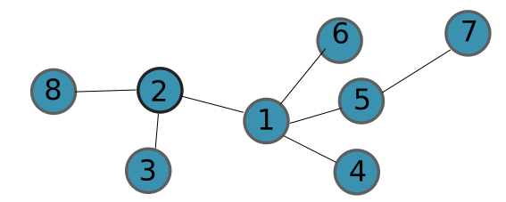
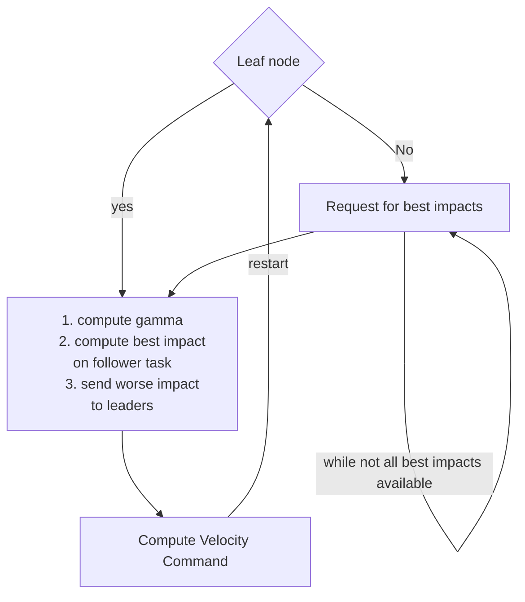

# General implementation idea

Consider a multi-agent system such that the task network topology is acyclic (a tree)



For this situation each agent is provided with a controller which is applied to satisfy all the tasks the agent is associated to. Namely, each agent is associate to a number of tasks equal to the number of edges connected to the agent itself in the task graph. For instance, agent 1 has 4 tasks to be satisfied together. The control architecture to solve the problem is based on the definition of a so called edge leadership. Namely, each edge in the task graph has a **leader** node and a **follower** node. The way the leader and the follower interact to satisfy the task associated with an edge is specified in the controller definition, but the general idea is that leader and follower are in a sort of **game** among each other where the leader shares the **best impact**


The controller for each agent is designed such that an agent is **leader** of a single task and it **follower** of all the others.


# Details on the Code 

The Agent for this simulation is composed of 5 mains components 

```python
MyPerceptionSystem
Transmitter
Receiver
HighLevelController
LowLevelController
```

## MyPerceptionsSystems
The system takes care of only updating the state of each agent in the form of saving the position of each agent as [x,y] coordinates. The state of the agent is directly provided by the environment module which in this case is `pybullet`

## Transmitter
The transmitter component is encharged with transmitting the two main types of messages `best_impact` and `worse_impact` that each agent has to send to the other other agents in the systems. The agent sends its `best_impact` value to the parent agent in the formation tree while the agent sends the `worse_impact` to the agent the child agent in the formation tree. This component is mainly triggered by the `HighLevelController` component in the sense that communication messages are sent only when the controller establishes that a new massages has to be sent.

## Receiver
The `Receiver` component is adept to store the `best_impact` and `worse_impact` impact received by other agents in the tree. Namely, every time a `best_impact` message is received from a neighbour in the task graph, this is saved among the parameters of the `HighLevelController` from which further computations are achieved within the controller. The same idea follows for `worse_impact` messages. Hence, the role of the `Receiver` component could be summaries as simply store the content of the best and worse impact messages from the network to the `HighLevelController` of the agent. 

## HighLevelController

The `HighLevelController` controller takes care of establishing an high level velocity command that has to be followed by each drone in the formation. Inside this component the the `compute` function is continuously called with the following flow of actions:




## LowLevelController
The lowe level controller actually takes care of sending the force and torque commands to the drone. This is done by receiving the velocity command from the high level controller and then a PD controller approach is applied to reach the desired velocity.

The dynamics of the system is the following. 

$\dot{v}_x = g\theta$

$\dot{v}_y = g\phi$

$\dot{\theta} = \frac{1}{I_y}\tau_y$

$\dot{\phi} = \frac{1}{I_x}\tau_x$


Hence by simple differentiations we have 

$\ddot{v}_x = \frac{g}{I_y}\tau_y$

$\ddot{v}_y = \frac{g}{I_x}\tau_x$

The torque is the then selected to stabilize this system to zero.