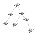
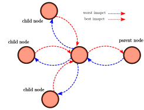

# Decentralized control of multi-agent systems under acyclic spatio-temporal task dependencies 
  

## [SymAware implementation]

This repo contains the code for the implmentation of the CBF-based decentralized control approach form multi-agent system under spatio-temporal constraints described in our recent publication:

[Decentralized control of multi-agent systems under acyclic spatio-temporal task dependencies ](https://arxiv.org/abs/2409.05106) G. Marchesini and S. Liu and L. Lindemann and D. V. Dimarogonas

<div align="center">
	
</div>


## Installation

To install all the dependencies needed to run the example python scripts, run the following command.
It is advisable to use a virtual environment (venv, conda) to avoid conflicts with other projects.

```bash
pip install -r requirements.txt --extra-index-url https://gitlab.mpi-sws.org/api/v4/projects/2668/packages/pypi/simple
```
## Simulation details
The main simulation file is located ar `simulations/stl_drone_example.py`.

The simulations hows an example of a multi-agent system composed of 5 drones connected by a star-graph. The system is tasked with viting two target locaitons while maintaining a given time-varying reference formation. The task assigned to the system can be divided in three phases : exploration of target 1, exploration of target 2 and return phase.

1) Exploration of target 1

$$  
\begin{align}
\phi_{1} = G_{[3,6]} (0.4 - \|x_1-[3.,3.]\| )\\
\phi_{12} = F_{[3,6]}G_{[0,1]} (0.3 - \|x_1- x_2 -[0.,1.]\| )\\
\phi_{13} = F_{[3,6]}G_{[0,1]} (0.3 - \|x_1- x_3 -[1.,0.]\| )\\
\phi_{14} = F_{[3,6]}G_{[0,1]} (0.3 - \|x_1- x_4 -[0.,-1.]\| )\\
\phi_{15} = F_{[3,6]}G_{[0,1]} (0.3 - \|x_1- x_5 -[-1.,0.]\| )\\
\end{align}
$$

2) Exploration of target 2

$$  
\begin{align}
\phi_{1}  = G_{[15,18]} (0.4 - \|x_1-[0.,6.]\| )\\
\phi_{12} = G_{[12,16]} (0.3 - \|x_1- x_2 -[1.,1. ]\| )\\
\phi_{13} = G_{[12,16]} (0.3 - \|x_1- x_3 -[1.,-1. ]\| )\\
\phi_{14} = G_{[12,16]} (0.3 - \|x_1- x_4 -[-1.,-1.]\| )\\
\phi_{15} = G_{[12,16]} (0.3 - \|x_1- x_5 -[-1.,1.]\| )\\
\end{align}
$$

3) Return phase 

$$  
\begin{align}
\phi_{1} = G_{[23,23]} (0.4 - \|x_1-[30.,0.]\| )\\
\phi_{12} = F_{[23,24]}G_{[0,4]} (0.3 - \|x_1- x_2 -[.5,.5 ]\| )\\
\phi_{13} = F_{[23,24]}G_{[0,4]} (0.3 - \|x_1- x_3 -[.5,-0.5 ]\| )\\
\phi_{14} = F_{[23,24]}G_{[0,4]} (0.3 - \|x_1- x_4 -[-.5,-.5]\| )\\
\phi_{15} = F_{[23,24]}G_{[0,4]} (0.3 - \|x_1- x_5 -[-.5,.5]\| )\\
\end{align}
$$


## Collaborative task 
polytope     = regular_2D_polytope(5, 0.3)
predicate    = CollaborativePredicate( polytope_0 = polytope, center = np.array([0.5,.5]),source_agent_id =1, target_agent_id =2 )
task         = (F(23,24)+ G(0,4)) @ predicate
task_graph.attach(task)

## Collaborative task 
polytope     = regular_2D_polytope(5, 0.3)
predicate    = CollaborativePredicate( polytope_0 = polytope, center = np.array([0.5,-0.5]),source_agent_id =1, target_agent_id =3 )
task         = (F(23,24)+ G(0,4)) @ predicate
task_graph.attach(task)

## Collaborative task 
polytope     = regular_2D_polytope(5, 0.3)
predicate    = CollaborativePredicate( polytope_0 = polytope, center = np.array([-0.5,-0.5]),source_agent_id =1, target_agent_id =4 )
task         = (F(23,24)+ G(0,4)) @ predicate
task_graph.attach(task)

## Collaborative task 
polytope     = regular_2D_polytope(5, 0.3)
predicate    = CollaborativePredicate( polytope_0 = polytope, center = np.array([-.5,.5]),source_agent_id =1, target_agent_id =5 )
task         = (F(23,24)+ G(0,4)) @ predicate
task_graph.attach(task)


# Details on the Code 

Each Agent for this simulation is composed of 5 mains components 

```python
PyBulletPerceptionSystem
PyBulletCamera
Transmitter
Receiver
VelocityController
HighLevelController
```


## PyBulletPerceptionSystem
The system takes care of updating the awareness of each agents by providing state information over the agent state in the `pybullet` environment. The state is given as position, velocity, orientation and angular velocity.

## Transmitter
The transmitter component applies for transmitting the two main types of messages : `best_impact` and `worse_impact`. The agent sends its `best_impact` value to the parent agent in the formation tree while it sends the `worse_impact` to the child agents in the formation tree. This component is mainly triggered by the `HighLevelController` component in the sense that communication messages are sent only when the controller establishes that a new massages has to be sent.

## Receiver
The `Receiver` component is adept to store the `best_impact` and `worse_impact` impact received by other agents in the tree. Namely, every time a `best_impact` message is received from a neighbour in the task graph, this is saved among the parameters of the `HighLevelController` from which further computations are achieved within the controller. The same idea follows for `worse_impact` messages. Hence, the role of the `Receiver` component could be summaries as simply store the content of the best and worse impact messages from the network to the `HighLevelController` of the agent. 

## HighLevelController

The `HighLevelController` controller takes care of establishing an high level velocity command that has to be followed by each drone in the formation. Inside this component the the `compute` function is continuously called with the following flow of actions:


<div align="center">
	
</div>

## LowLevelController
The low level controller takes care of sending the force and torque commands to the drone to achieve the velocity reference set by the `HighLevelController` applying a PD controller to reach the desired velocity.

## Acknowledgements
This work was supported in part by the Horizon Europe EIC project SymAware (101070802), the ERC LEAFHOUND Project, the Swedish Research Council (VR), Digital Futures, and the Knut and Alice Wallenberg (KAW) Foundation. 

## Contacts
For any question you can contact the developers team at the main SymAware [here](https://gitlab.mpi-sws.org/sadegh/eicsymaware/-/tree/base?ref_type=heads)

Happy Coding!:)